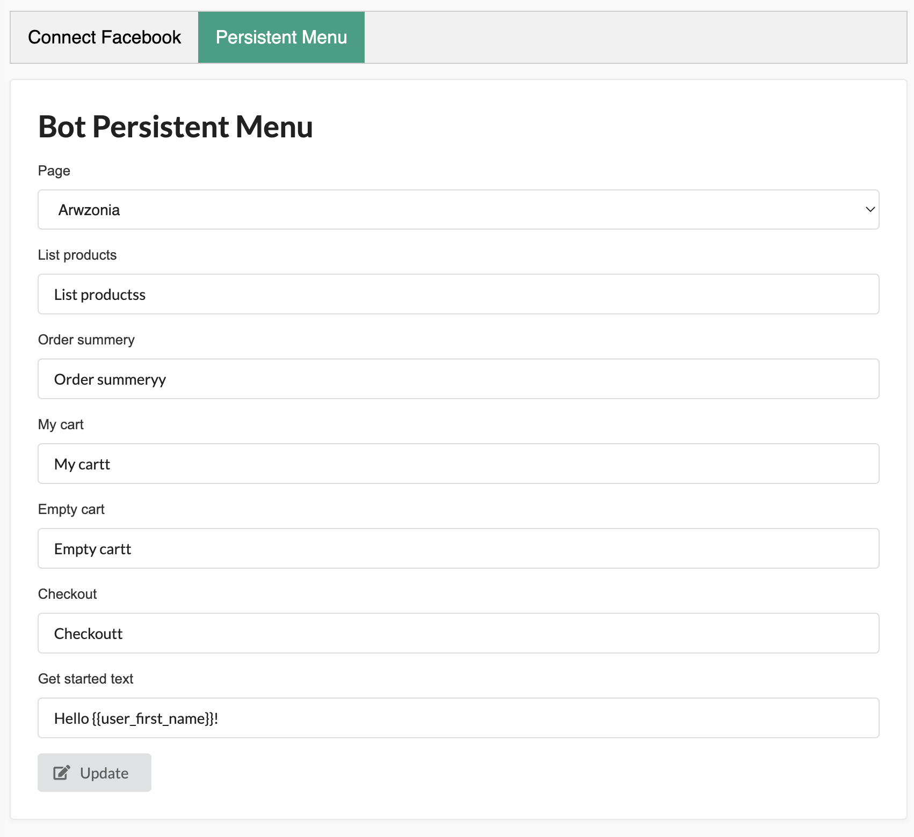

<h1 align="center">
    
    <p>
    Sylius Bot Plugin
    </p>
</h1>

<p align="center">Facebook messenger shopping for sylius to give your store a new shoping experience</p>

<p align="center">
    <a href="https://sylius.com" target="_blank">
        
    </a>
</p>

## Screenshots
<details>





</details>

## Pre-installation
- [create facebook app](https://developers.facebook.com/docs/development/create-an-app/) and add messenger product to your app 

- [download ngrok](https://ngrok.com/download)

## Installation
1. Install using composer 
    ```bash 
    composer require ahmedkhd/sylius-bot-plugin
    ```
2. Add this to .env
    ```dotenv
    APP_URL=<ngrok-link>
    FACEBOOK_APP_ID=<fb-app-id>
    FACEBOOK_APP_SECRET=<fb-app-secret>
    FACEBOOK_GRAPH_URL=<fb-graph-url>
    FACEBOOK_GRAPH_VERSION=<fb-app-version | v15.0>
    FACEBOOK_VERIFICATION=<you-personal-verify-token | sylius>
    ```
    > Note : feel free to change the FACEBOOK_VERIFICATION token as you need (this value will be used via facebook to verify the webhook).

3. Add the following import to `_sylius.yaml`:
    ```yml
    imports:
        # ...
        - { resource: '@SyliusBotPlugin/Resources/config/app/config.yml' }
    
    ```

4. Import routes inside your routes.yml
    ```yml
    sylius_bot_plugin_sylius_bot:
        resource: "@SyliusBotPlugin/Resources/config/routes.yml"
    ```

5. Run `php bin/console doctrine:schema:update --force`

6. Start ngrok with  `ngrok http 80` 

   warn : sometimes there is an issue with facebook and can't accepts ngrok requests sometimes using this command helps `ngrok http https://localhost:80 --host-header="localhost:80"`

7. open Developers facebook platform > Messenger > Settings
    ```dotenv
    Callback URL : <NGROK_LINK>/webhook/messenger
    Verify Token : value of this env FACEBOOK_VERIFICATION
    ```

8. login to sylius admin dashboard and got to `Messenger` tab and click on `Facebook Login` button and choose your pages 
9. go to second tab `Persistent Menu` and update your bot persistent menu and getting started button message
   > IMPORTANT every bot should have persistent menu to fulfill the shopping experience on messenger

10. That's it :smile: open your page and start talking to you bot :tada:


## Contribution
- [Contribution Guide](https://github.com/aa-ahmed-aa/SyliusBotPlugin/blob/master/docs/CUSTOMIZATION.md)
